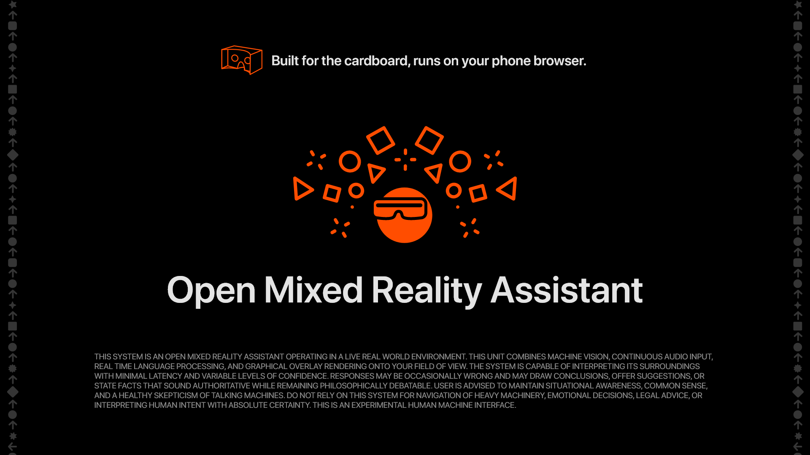
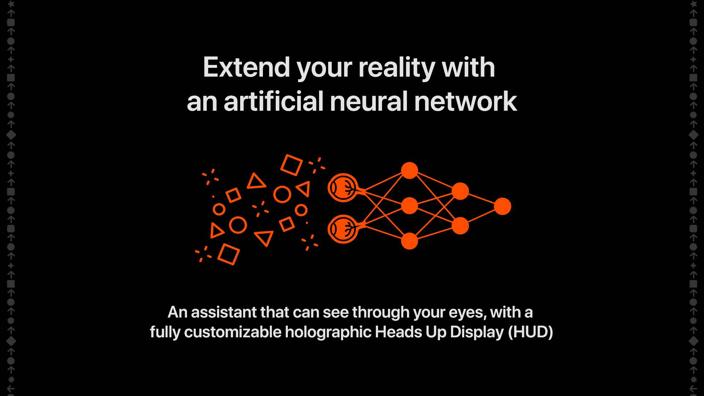
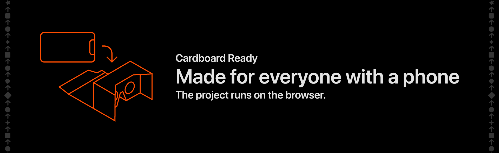

# Reality Machines
Open, hackable mixed reality assistants

---

Reality Machine - as the type of hackable mixed reality machines that can render holograms, interact with AI assistants and all the other cool stuff on it.

---

The Reality Machines Manifesto

A world without open and hackable augmented reality machines can have catastrophic consequences, as corporates could one day own your reality, and change the way you see the world at their will, for profit.

A reality machine stands to mixed reality glasses as a cyberdeck stands to a laptop. It is a fully hackable DIY piece of software and/or hardware that when put together can extend the way you see and interact with the real world by bridging it with the digital world.

This project is not a specification to be followed line by line. The code is only an example. The core of reality machines is the philosophy behind them, not the implementation.

One possible implementation, like the one in this repo, is to bend mobile phones functionality with a WebXR approach. RReality machines are not limited to phones, headsets, or any specific device. They can be low tech or extremely advanced. They can be made from cardboard, or exist purely as software running on an Apple Vision Pro.

To build a reality machine is to build a new way to interact with reality at your will, without depending on big corporations to provide the software or hardware for you. You must be able to develop and control it on your own, and join a community of others.

Reality machines are our answer to that. A piece of technology and ideology that bends the actual reality with digital elements, an enhanced experienced curated and manufactured by yourself, fully DIY.

"You are not a gadget." - Jaron Lanier, father of virtual reality.
